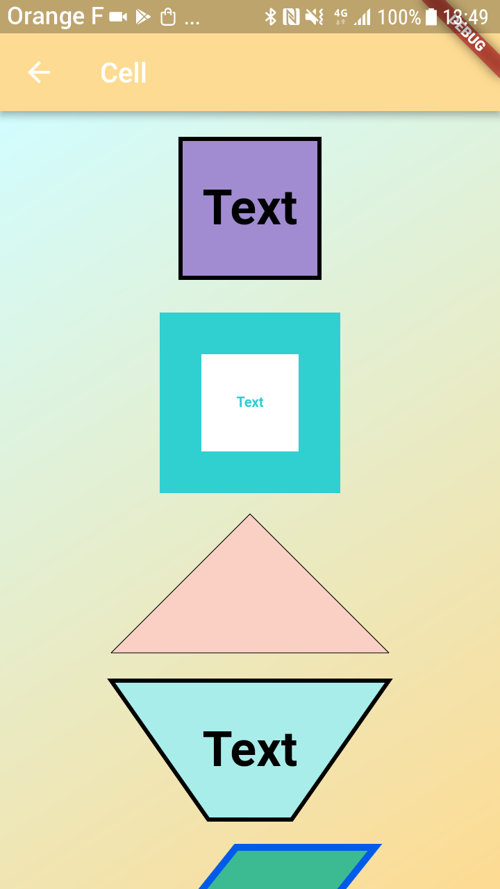
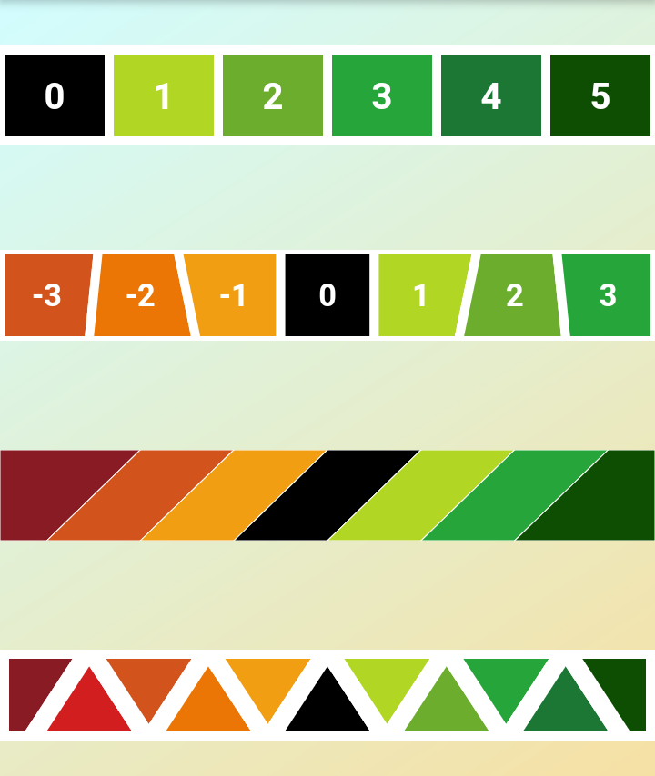

# flutter_custom_slider

A custom cursor created from the CustomPaint widget

## Cell : 

The sample show different kind of cells that is possible to build :

## Bars :

The sample also show what is is possible to do with different kind of cells :

